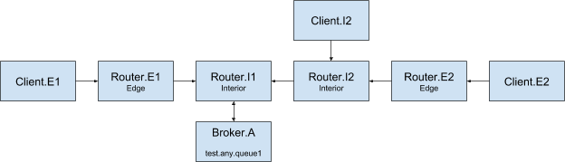

# Simple edge mode based topology

## Description
    

## Graph

## Elements

### Brokers

- Broker.A
  - Queue
    - test (Any/Multi)
  - No authentication

### Clients

- Client.I1 (interior)
- Client.I2 (interior)
- Client.E1 (edge)
- Client.E2 (edge)

### Routers

- Router.I1 (interior)
- Router.I2 (interior)
- Router.E1 (edge)
- Router.E2 (edge)

## TODO

- Interior's routers with broker
- Interior's clients (I1-I2)
- Edge's routers (E1-E2)
- Edge's clients (E1-E2)