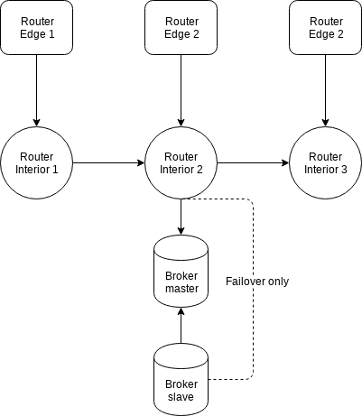

# Qpid Dispatch - Edge based topology 02

## Description

## Graph

## Elements

### Brokers

Failover

- Broker.A
- Broker.B

### Clients

- Client.E1 (edge)
- Client.E2 (edge)
- Client.E2 (edge)

### Routers

- Router.I1 (interior)
- Router.I2 (interior)
- Router.I3 (interior)
- Router.E1 (edge)
- Router.E2 (edge)
