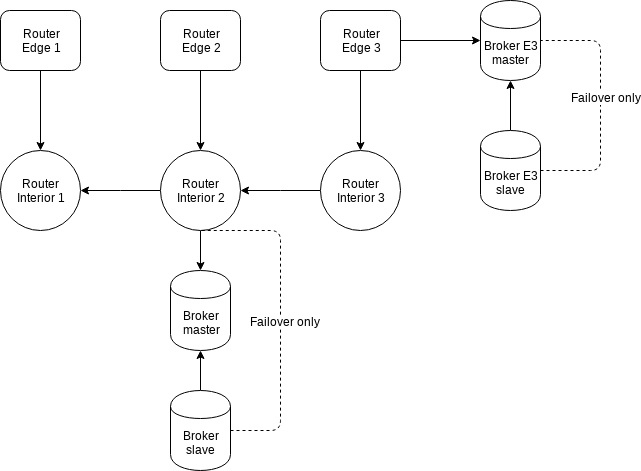

# Qpid Dispatch - Edge based topology 02

## Description

## Graph



## Elements

### Brokers

Failover

- Broker.A
- Broker.B

### Clients

- Client.E1 (edge)
- Client.E2 (edge)
- Client.E3 (edge)

### Routers

- Router.I1 (interior)
  - 5672 open for managements
  - 5656 open for inter-router
  - 5678 open for edges (SASL Anonymous)
- Router.I2 (interior)
  - 5672 open for managements
  - 5656 open for inter-router
  - 5678 open for edges (SASL Auth. required)
- Router.I3 (interior)
  - 5672 open for managements
  - 5656 open for inter-router
  - 5678 open for edges (TLS Aut. requierd)

- Router.E1 (edge)
  - 5672 open for managements
  - 5677 open for clients (SASL Anonymous)
- Router.E2 (edge)
  - 5672 open for managements
  - 5677 open for clients (SASL Auth. required)
- Router.E3 (edge)
  - 5672 open for managements
  - 5677 open for clients (TLS Aut. requierd)

## Deployment

```bash
ansible-playbook -i inventory.yml playbook.yml
```